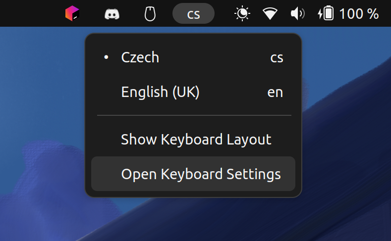

# Keyboard Indicator Settings

`Keyboard Indicator Settings` is a GNOME 42 extension that adds a keyboard settings menu item into the keyboard indicator.



## Installation

```bash
# Install git
sudo apt install git -y

# Install GNOME Shell Extensions
sudo add-apt-repository universe -y
sudo apt install gnome-shell-extensions -y

# Clone the repository
git clone https://github.com/DavidL344/keyboard-indicator-settings.git ~/.local/share/gnome-shell/extensions/keyboard-indicator-settings@david.langr.tech
```

After the installation, restart the GNOME Shell by pressing `Alt` + `F2`, typing `r` and pressing `Enter`.
Then, enable the extension by running the following command:

```bash
# Enable the extension
gnome-extensions enable keyboard-indicator-settings@david.langr.tech
```

## Updating

```bash
# Pull the latest changes
cd ~/.local/share/gnome-shell/extensions/keyboard-indicator-settings@david.langr.tech
git pull
```

## Removal

```bash
# Disable the extension
gnome-extensions disable keyboard-indicator-settings@david.langr.tech

# Remove the extension
rm -rf ~/.local/share/gnome-shell/extensions/keyboard-indicator-settings@david.langr.tech
```

After the removal, restart the GNOME Shell by pressing `Alt` + `F2`, typing `r` and pressing `Enter`.
